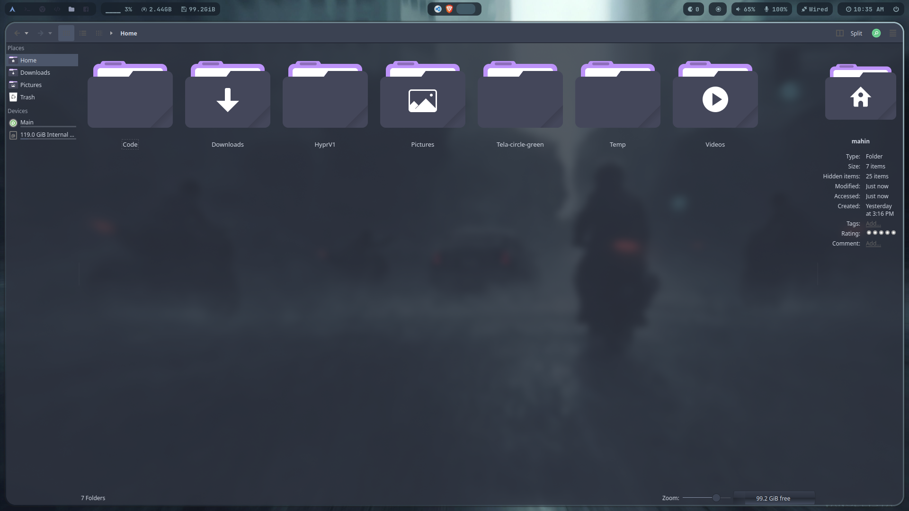

<br>
<h1 align = "center"> Arch Linux + Simple Hyprland Dotfiles</h1>
</br>


## Screenshots





### Main Components:

- WM: [`Hyprland`](https://github.com/hyprwm/Hyprland) - install it while installing arch linux with `archinstall` script.
 
- Terminal 1: [`Alacritty`](https://github.com/alacritty/alacritty)

- Terminal 2: [`Kitty`](https://github.com/kovidgoyal/kitty)
 
- Status bar: [`Waybar`](https://github.com/Alexays/Waybar)
 
- Menu: [`Wofi`](https://hg.sr.ht/~scoopta/wofi)

- File Manager 2: [`Dolphin`](https://github.com/KDE/dolphin)

### [Note] This is the first time I am sharing my dotfiles. This one may be not the best config, but I personally love it.</br>

## [ Must Read ]
As I use only a Desktop Pc, I don't have any laptop. That's why I could not test some features like Bletooth and Brightness Controller. Also this script is not supported for Nvidia GPU Drivers and Asus ROG laptops. I will fix this very soon...

## Clone the repository and every necessary packages will be installed in your system.

### Packages I have used for this configuration:
- (all of the above components) plus
- `swwww` - for wallpaper and wallpaper animation
- `swaylock` - for lockscreen
- `swaylock-effects` - for swaylock effects
- `cava` - for terminal based music visualizer
- `dunst` - for notifications
- `hyprshot` - for screenshot
- `brightnessctl`  - for monitor and keyboard brightness - not needed for desktop
- `nomacs` or `swayimg` - for image viewer 
- `pamixer` - for volume control notification.
- `fonts` - required awesome fonts. AUR and official repo have
- `pipewire` - needed pipewire pipewire-pulse pipewire-alsa
- `lxappearence` - for gtk themes
 </br>

### Themes (Optional):
- I have used Nordic theme as the dark theme and Snow-v40 as the light theme `(For GTk Themes)` You can change themes using `lxappearance`.

### Clone and Copy my dotfiles (inside your `/home` directory)
After you have installed all the tools, now clone my dotfiles.

```
git clone https://github.com/md-mahin-islam-mahi/HyprV1.git
```
Now run these commands

```
cd HyprV1
chmod +x HyprV1
./HyprV1
```

## After you have installed successfully, press ` Mod(Windows Button) + Shift + H ` to see the key bindings.

<br>
 